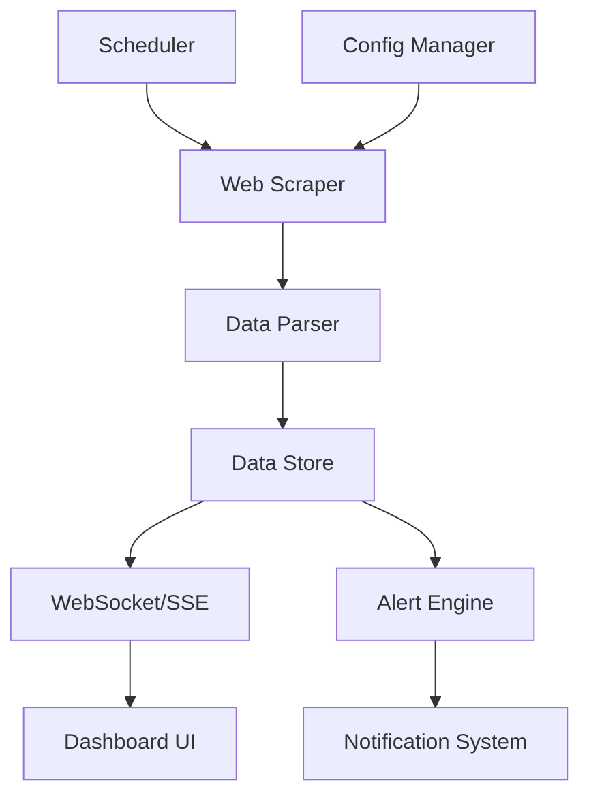

# Lightweight Monitoring Dashboard Architecture

## System Overview
A minimal web application that scrapes HTML data from websites and displays real-time status information with alerts and basic visualizations.

## Technology Stack
- **Backend**: Node.js with Express
- **Frontend**: Vanilla HTML/CSS/JavaScript (no frameworks)
- **Data Fetching**: Node.js built-in modules (axios/cheerio for scraping)
- **Real-time Updates**: Server-Sent Events (SSE)
- **Visualization**: Chart.js (lightweight charting library)
- **Storage**: In-memory with optional JSON file persistence

## System Architecture



## Core Components

### 1. Backend (Node.js)
- **Web Scraper Module**: Fetches HTML from target websites
- **Data Parser**: Extracts specific text data using CSS selectors
- **Scheduler**: Triggers scraping every minute
- **API Server**: Serves dashboard and provides data endpoints
- **SSE Server**: Pushes real-time updates to frontend
- **Alert Engine**: Monitors data changes and triggers alerts

### 2. Frontend (Vanilla JS)
- **Dashboard UI**: Clean, responsive interface
- **Real-time Updates**: Receives data via SSE
- **Visualization**: Simple charts and status indicators
- **Alert Display**: Shows notifications for status changes
- **Configuration Panel**: Manage monitored sites

## Data Flow

1. **Scheduler** triggers scraping every minute
2. **Web Scraper** fetches HTML from configured websites
3. **Data Parser** extracts specific text data using CSS selectors
4. **Data Store** maintains current and historical data
5. **Alert Engine** checks for changes and triggers alerts
6. **SSE Server** pushes updates to connected clients
7. **Dashboard UI** updates in real-time with new data

## File Structure
```
monitoring-dashboard/
├── server/
│   ├── app.js              # Main server application
│   ├── scraper.js          # Web scraping module
│   ├── parser.js           # Data parsing logic
│   ├── scheduler.js        # Task scheduler
│   ├── alerts.js           # Alert engine
│   └── config.js           # Configuration management
├── public/
│   ├── index.html          # Dashboard UI
│   ├── css/
│   │   └── style.css       # Styles
│   ├── js/
│   │   ├── dashboard.js    # Dashboard logic
│   │   └── charts.js       # Visualization
│   └── config.json         # Default site configurations
├── data/
│   └── cache.json          # Optional data persistence
└── package.json            # Dependencies
```

## Performance Considerations

### Lightweight Design Principles
1. **Minimal Dependencies**: Use only essential packages
2. **Efficient Scraping**: 
   - Request timeout limits
   - Concurrent request limiting
   - Request caching
3. **Optimized Frontend**:
   - No heavy frameworks
   - Minimal CSS
   - Efficient DOM updates
4. **Smart Refresh**:
   - Only update changed data
   - Debounce visual updates
   - Lazy load charts

### Resource Management
- Connection pooling for HTTP requests
- Memory usage monitoring
- Automatic cleanup of old data
- Rate limiting to prevent overwhelming target sites

## Configuration Format
```json
{
  "sites": [
    {
      "name": "Example Site",
      "url": "https://example.com",
      "selector": "#status-text",
      "alertThresholds": {
        "enabled": true,
        "conditions": ["contains:error", "equals:down"]
      }
    }
  ],
  "refreshInterval": 60000,
  "maxRetries": 3,
  "timeout": 10000
}
```

## Alert System
- **Threshold-based**: Alert when data matches specific conditions
- **Change Detection**: Alert when data changes from previous values
- **Notification Types**: Visual alerts in dashboard, optional browser notifications
- **Alert History**: Maintain log of recent alerts

## Deployment Options
1. **Local Development**: `npm start` and open http://localhost:3000
2. **Docker Container**: Minimal alpine-based image
3. **Cloud Deployment**: Vercel, Netlify (serverless functions), or small VPS

## Security Considerations
- CORS configuration for API endpoints
- Input sanitization for selectors
- Rate limiting for scraping requests
- Optional basic authentication for dashboard access