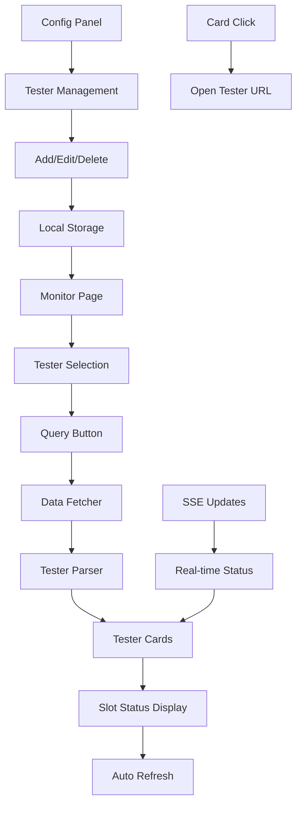

# Tester Monitoring Dashboard Design

## Updated Requirements Analysis

Based on the sample data provided, the system needs to monitor test equipment (testers) with the following characteristics:
- Each tester has a unique name (e.g., "CS8210_ESS07")
- Each tester contains multiple slots (SLOT01-SLOT16, CHAMBER01)
- Each slot shows status and test time
- Slots have different visual states (normal, failing, available)
- Each tester is accessible via a specific URL (e.g., http://192.168.140.102:8080)

## Updated System Architecture



## Data Model

### Tester Configuration
```json
{
  "testers": [
    {
      "id": "ess08",
      "name": "ESS08",
      "url": "http://192.168.140.103:8080",
      "enabled": true,
      "selector": "#CS8210_ESS08_add_table",
      "slotSelector": "tbody tr td a"
    }
  ]
}
```

### Parsed Tester Data
```json
{
  "id": "ess08",
  "name": "CS8210_ESS08",
  "url": "http://192.168.140.103:8080",
  "timestamp": "2023-10-16T07:05:00.000Z",
  "slots": [
    {
      "name": "SLOT01",
      "status": "running",
      "time": "2:28:50",
      "statusClass": "btn-normal"
    },
    {
      "name": "SLOT06",
      "status": "failing",
      "time": "2:28:50",
      "statusClass": "btn-failing"
    },
    {
      "name": "SLOT16",
      "status": "available",
      "time": "Available",
      "statusClass": "btn-secondary"
    }
  ]
}
```

## Frontend Components

### 1. Monitor Page Structure
```html
<!DOCTYPE html>
<html lang="en">
<head>
    <meta charset="UTF-8">
    <meta name="viewport" content="width=device-width, initial-scale=1.0">
    <title>Tester Monitoring Dashboard</title>
    <link rel="stylesheet" href="css/style.css">
</head>
<body>
    <div class="container">
        <header>
            <h1>Tester Monitoring Dashboard</h1>
            <div class="header-controls">
                <button id="config-btn" class="btn btn-primary">Configuration</button>
                <div class="status-indicator">
                    <span id="connection-status">Connected</span>
                    <span id="last-update">Never</span>
                </div>
            </div>
        </header>

        <main>
            <!-- Tester Selection Section -->
            <section class="tester-selection">
                <h2>Select Testers to Monitor</h2>
                <div class="tester-checkboxes" id="tester-checkboxes">
                    <!-- Checkboxes will be populated here -->
                </div>
                <div class="selection-controls">
                    <button id="select-all" class="btn btn-secondary">Select All</button>
                    <button id="deselect-all" class="btn btn-secondary">Deselect All</button>
                    <button id="query-btn" class="btn btn-success">Start Monitoring</button>
                </div>
            </section>

            <!-- Tester Cards Grid -->
            <section class="tester-dashboard" id="tester-dashboard">
                <!-- Tester cards will be displayed here -->
            </section>
        </main>
    </div>

    <!-- Configuration Modal -->
    <div id="config-modal" class="modal">
        <div class="modal-content">
            <div class="modal-header">
                <h2>Tester Configuration</h2>
                <span class="close">&times;</span>
            </div>
            <div class="modal-body">
                <div class="config-controls">
                    <button id="add-tester" class="btn btn-primary">Add Tester</button>
                </div>
                <table class="config-table">
                    <thead>
                        <tr>
                            <th>Display Name</th>
                            <th>URL</th>
                            <th>Actions</th>
                        </tr>
                    </thead>
                    <tbody id="config-table-body">
                        <!-- Configuration rows will be populated here -->
                    </tbody>
                </table>
            </div>
        </div>
    </div>

    <script src="js/tester-dashboard.js"></script>
</body>
</html>
```

### 2. Tester Card Component
```html
<!-- Template for tester card -->
<template id="tester-card-template">
    <div class="tester-card" data-tester-id="">
        <div class="card-header">
            <h3 class="tester-name"></h3>
            <button class="url-btn" title="Open Tester URL">
                <svg width="16" height="16" viewBox="0 0 24 24" fill="none" stroke="currentColor">
                    <path d="M18 13v6a2 2 0 0 1-2 2H5a2 2 0 0 1-2-2V8a2 2 0 0 1 2-2h6"></path>
                    <polyline points="15,3 21,3 21,9"></polyline>
                    <line x1="10" y1="14" x2="21" y2="3"></line>
                </svg>
            </button>
            <div class="tester-status">
                <span class="status-indicator"></span>
                <span class="last-update"></span>
            </div>
        </div>
        <div class="card-body">
            <div class="slots-grid">
                <!-- Slots will be populated here -->
            </div>
        </div>
    </div>
</template>

<!-- Template for slot -->
<template id="slot-template">
    <div class="slot" data-slot-name="">
        <div class="slot-name"></div>
        <div class="slot-time"></div>
    </div>
</template>
```

### 3. CSS Styling for Tester Cards
```css
/* Tester Card Styles */
.tester-dashboard {
    display: grid;
    grid-template-columns: repeat(auto-fill, minmax(400px, 1fr));
    gap: 20px;
    margin-top: 30px;
}

.tester-card {
    background: white;
    border-radius: 12px;
    box-shadow: 0 4px 6px rgba(0, 0, 0, 0.1);
    overflow: hidden;
    transition: transform 0.2s, box-shadow 0.2s;
    cursor: pointer;
}

.tester-card:hover {
    transform: translateY(-2px);
    box-shadow: 0 8px 15px rgba(0, 0, 0, 0.1);
}

.tester-card.error {
    border-top: 4px solid #dc3545;
}

.tester-card.warning {
    border-top: 4px solid #ffc107;
}

.tester-card.success {
    border-top: 4px solid #28a745;
}

.card-header {
    background-color: #f8f9fa;
    padding: 15px 20px;
    display: flex;
    justify-content: space-between;
    align-items: center;
    border-bottom: 1px solid #dee2e6;
}

.tester-name {
    margin: 0;
    font-size: 1.25rem;
    font-weight: 600;
    color: #495057;
}

.url-btn {
    background: none;
    border: none;
    color: #007bff;
    cursor: pointer;
    padding: 5px;
    border-radius: 4px;
    transition: background-color 0.2s;
}

.url-btn:hover {
    background-color: #e9ecef;
}

.tester-status {
    display: flex;
    align-items: center;
    gap: 10px;
    font-size: 0.875rem;
    color: #6c757d;
}

.status-indicator {
    width: 8px;
    height: 8px;
    border-radius: 50%;
    background-color: #28a745;
}

.status-indicator.error {
    background-color: #dc3545;
}

.status-indicator.warning {
    background-color: #ffc107;
}

.card-body {
    padding: 20px;
}

.slots-grid {
    display: grid;
    grid-template-columns: repeat(3, 1fr);
    gap: 10px;
}

.slot {
    background-color: #f8f9fa;
    border-radius: 8px;
    padding: 10px;
    text-align: center;
    transition: background-color 0.2s;
}

.slot.running {
    background-color: #d4edda;
    border: 1px solid #c3e6cb;
}

.slot.failing {
    background-color: #f8d7da;
    border: 1px solid #f5c6cb;
}

.slot.available {
    background-color: #e2e3e5;
    border: 1px solid #ced4da;
}

.slot-name {
    font-weight: 600;
    font-size: 0.875rem;
    margin-bottom: 5px;
}

.slot-time {
    font-size: 0.75rem;
    color: #6c757d;
}

/* Selection Section */
.tester-selection {
    background: white;
    border-radius: 8px;
    padding: 20px;
    box-shadow: 0 2px 4px rgba(0, 0, 0, 0.1);
    margin-bottom: 20px;
}

.tester-checkboxes {
    display: grid;
    grid-template-columns: repeat(auto-fill, minmax(200px, 1fr));
    gap: 10px;
    margin: 20px 0;
}

.tester-checkbox {
    display: flex;
    align-items: center;
    padding: 10px;
    border-radius: 4px;
    transition: background-color 0.2s;
}

.tester-checkbox:hover {
    background-color: #f8f9fa;
}

.tester-checkbox input[type="checkbox"] {
    margin-right: 10px;
}

.selection-controls {
    display: flex;
    gap: 10px;
    justify-content: center;
    margin-top: 20px;
}

/* Configuration Modal */
.modal {
    display: none;
    position: fixed;
    z-index: 1000;
    left: 0;
    top: 0;
    width: 100%;
    height: 100%;
    background-color: rgba(0, 0, 0, 0.5);
}

.modal-content {
    background-color: white;
    margin: 5% auto;
    padding: 0;
    border-radius: 8px;
    width: 80%;
    max-width: 800px;
    max-height: 80vh;
    overflow-y: auto;
}

.modal-header {
    display: flex;
    justify-content: space-between;
    align-items: center;
    padding: 20px;
    border-bottom: 1px solid #dee2e6;
}

.modal-body {
    padding: 20px;
}

.close {
    font-size: 28px;
    font-weight: bold;
    cursor: pointer;
}

.config-table {
    width: 100%;
    border-collapse: collapse;
    margin-top: 20px;
}

.config-table th,
.config-table td {
    padding: 12px;
    text-align: left;
    border-bottom: 1px solid #dee2e6;
}

.config-table th {
    background-color: #f8f9fa;
    font-weight: 600;
}

.btn {
    padding: 8px 16px;
    border: none;
    border-radius: 4px;
    cursor: pointer;
    font-size: 14px;
    transition: background-color 0.2s;
}

.btn-primary {
    background-color: #007bff;
    color: white;
}

.btn-primary:hover {
    background-color: #0056b3;
}

.btn-success {
    background-color: #28a745;
    color: white;
}

.btn-success:hover {
    background-color: #1e7e34;
}

.btn-secondary {
    background-color: #6c757d;
    color: white;
}

.btn-secondary:hover {
    background-color: #545b62;
}

.btn-danger {
    background-color: #dc3545;
    color: white;
}

.btn-danger:hover {
    background-color: #c82333;
}
```

## JavaScript Implementation

### 1. Main Dashboard Controller
```javascript
// js/tester-dashboard.js
class TesterDashboard {
    constructor() {
        this.testers = [];
        this.selectedTesters = new Set();
        this.activeMonitoring = false;
        this.refreshInterval = null;
        this.eventSource = null;
        
        this.init();
    }

    async init() {
        await this.loadConfiguration();
        this.setupEventListeners();
        this.renderTesterSelection();
    }

    async loadConfiguration() {
        const stored = localStorage.getItem('tester-config');
        if (stored) {
            this.testers = JSON.parse(stored);
        } else {
            // Default configuration
            this.testers = [
                {
                    id: 'ess07',
                    name: 'ESS07',
                    url: 'http://192.168.140.102:8080',
                    enabled: true,
                    selector: '#CS8210_ESS07_add_table'
                }
            ];
            this.saveConfiguration();
        }
    }

    saveConfiguration() {
        localStorage.setItem('tester-config', JSON.stringify(this.testers));
    }

    setupEventListeners() {
        // Selection controls
        document.getElementById('select-all').addEventListener('click', () => this.selectAllTesters());
        document.getElementById('deselect-all').addEventListener('click', () => this.deselectAllTesters());
        document.getElementById('query-btn').addEventListener('click', () => this.startMonitoring());

        // Configuration
        document.getElementById('config-btn').addEventListener('click', () => this.openConfigModal());
        document.getElementById('add-tester').addEventListener('click', () => this.addTester());
        
        // Modal close
        document.querySelector('.close').addEventListener('click', () => this.closeConfigModal());
        window.addEventListener('click', (e) => {
            if (e.target.classList.contains('modal')) {
                this.closeConfigModal();
            }
        });
    }

    renderTesterSelection() {
        const container = document.getElementById('tester-checkboxes');
        container.innerHTML = '';

        this.testers.forEach(tester => {
            const checkbox = document.createElement('div');
            checkbox.className = 'tester-checkbox';
            checkbox.innerHTML = `
                <input type="checkbox" id="tester-${tester.id}" value="${tester.id}">
                <label for="tester-${tester.id}">${tester.name}</label>
            `;
            
            checkbox.querySelector('input').addEventListener('change', (e) => {
                if (e.target.checked) {
                    this.selectedTesters.add(tester.id);
                } else {
                    this.selectedTesters.delete(tester.id);
                }
            });
            
            container.appendChild(checkbox);
        });
    }

    selectAllTesters() {
        const checkboxes = document.querySelectorAll('.tester-checkbox input[type="checkbox"]');
        checkboxes.forEach(cb => {
            cb.checked = true;
            this.selectedTesters.add(cb.value);
        });
    }

    deselectAllTesters() {
        const checkboxes = document.querySelectorAll('.tester-checkbox input[type="checkbox"]');
        checkboxes.forEach(cb => {
            cb.checked = false;
        });
        this.selectedTesters.clear();
    }

    async startMonitoring() {
        if (this.selectedTesters.size === 0) {
            alert('Please select at least one tester to monitor');
            return;
        }

        this.activeMonitoring = true;
        document.getElementById('query-btn').textContent = 'Stop Monitoring';
        document.getElementById('query-btn').classList.remove('btn-success');
        document.getElementById('query-btn').classList.add('btn-danger');
        
        // Clear existing cards
        document.getElementById('tester-dashboard').innerHTML = '';
        
        // Create cards for selected testers
        this.selectedTesters.forEach(testerId => {
            const tester = this.testers.find(t => t.id === testerId);
            if (tester) {
                this.createTesterCard(tester);
            }
        });

        // Initial data fetch
        await this.fetchTesterData();

        // Set up auto-refresh
        this.refreshInterval = setInterval(() => {
            this.fetchTesterData();
        }, 60000); // Refresh every minute

        // Set up SSE for real-time updates
        this.connectEventSource();
    }

    stopMonitoring() {
        this.activeMonitoring = false;
        
        if (this.refreshInterval) {
            clearInterval(this.refreshInterval);
            this.refreshInterval = null;
        }

        if (this.eventSource) {
            this.eventSource.close();
            this.eventSource = null;
        }

        document.getElementById('query-btn').textContent = 'Start Monitoring';
        document.getElementById('query-btn').classList.remove('btn-danger');
        document.getElementById('query-btn').classList.add('btn-success');
    }

    createTesterCard(tester) {
        const template = document.getElementById('tester-card-template');
        const clone = template.content.cloneNode(true);
        
        const card = clone.querySelector('.tester-card');
        card.dataset.testerId = tester.id;
        
        clone.querySelector('.tester-name').textContent = tester.name;
        
        // Add click handler for opening URL
        clone.querySelector('.url-btn').addEventListener('click', (e) => {
            e.stopPropagation();
            window.open(tester.url, '_blank');
        });
        
        // Add click handler for the entire card
        card.addEventListener('click', () => {
            window.open(tester.url, '_blank');
        });
        
        document.getElementById('tester-dashboard').appendChild(clone);
    }

    async fetchTesterData() {
        const selectedTestersArray = Array.from(this.selectedTesters);
        
        for (const testerId of selectedTestersArray) {
            const tester = this.testers.find(t => t.id === testerId);
            if (tester) {
                try {
                    const response = await fetch(`/api/tester/${testerId}`);
                    const data = await response.json();
                    this.updateTesterCard(testerId, data);
                } catch (error) {
                    console.error(`Error fetching data for ${tester.name}:`, error);
                    this.updateTesterCardError(testerId, error.message);
                }
            }
        }

        document.getElementById('last-update').textContent = new Date().toLocaleTimeString();
    }

    updateTesterCard(testerId, data) {
        const card = document.querySelector(`[data-tester-id="${testerId}"]`);
        if (!card) return;

        // Update status indicator
        const statusIndicator = card.querySelector('.status-indicator');
        const lastUpdate = card.querySelector('.last-update');
        
        statusIndicator.className = 'status-indicator';
        lastUpdate.textContent = new Date(data.timestamp).toLocaleTimeString();

        // Determine overall status
        const hasFailing = data.slots.some(slot => slot.status === 'failing');
        const hasRunning = data.slots.some(slot => slot.status === 'running');
        
        if (hasFailing) {
            statusIndicator.classList.add('error');
            card.className = 'tester-card error';
        } else if (hasRunning) {
            statusIndicator.classList.add('success');
            card.className = 'tester-card success';
        } else {
            statusIndicator.classList.add('warning');
            card.className = 'tester-card warning';
        }

        // Update slots
        const slotsGrid = card.querySelector('.slots-grid');
        slotsGrid.innerHTML = '';

        data.slots.forEach(slot => {
            const slotElement = this.createSlotElement(slot);
            slotsGrid.appendChild(slotElement);
        });
    }

    createSlotElement(slot) {
        const template = document.getElementById('slot-template');
        const clone = template.content.cloneNode(true);
        
        const slotDiv = clone.querySelector('.slot');
        slotDiv.dataset.slotName = slot.name;
        slotDiv.className = `slot ${slot.status}`;
        
        clone.querySelector('.slot-name').textContent = slot.name;
        clone.querySelector('.slot-time').textContent = slot.time;
        
        return clone;
    }

    updateTesterCardError(testerId, error) {
        const card = document.querySelector(`[data-tester-id="${testerId}"]`);
        if (!card) return;

        card.className = 'tester-card error';
        const statusIndicator = card.querySelector('.status-indicator');
        statusIndicator.className = 'status-indicator error';
        
        const slotsGrid = card.querySelector('.slots-grid');
        slotsGrid.innerHTML = `<div class="error-message">Error: ${error}</div>`;
    }

    connectEventSource() {
        this.eventSource = new EventSource('/events');
        
        this.eventSource.onmessage = (event) => {
            const data = JSON.parse(event.data);
            if (data.type === 'tester-update') {
                this.updateTesterCard(data.testerId, data.data);
            }
        };

        this.eventSource.onerror = () => {
            document.getElementById('connection-status').textContent = 'Disconnected';
            document.getElementById('connection-status').classList.add('error');
        };

        this.eventSource.onopen = () => {
            document.getElementById('connection-status').textContent = 'Connected';
            document.getElementById('connection-status').classList.remove('error');
        };
    }

    // Configuration management
    openConfigModal() {
        document.getElementById('config-modal').style.display = 'block';
        this.renderConfigTable();
    }

    closeConfigModal() {
        document.getElementById('config-modal').style.display = 'none';
    }

    renderConfigTable() {
        const tbody = document.getElementById('config-table-body');
        tbody.innerHTML = '';

        this.testers.forEach((tester, index) => {
            const row = document.createElement('tr');
            row.innerHTML = `
                <td>${tester.name}</td>
                <td>${tester.url}</td>
                <td>
                    <button class="btn btn-sm btn-primary edit-btn" data-index="${index}">Edit</button>
                    <button class="btn btn-sm btn-danger delete-btn" data-index="${index}">Delete</button>
                </td>
            `;
            tbody.appendChild(row);
        });

        // Add event listeners for edit/delete buttons
        tbody.querySelectorAll('.edit-btn').forEach(btn => {
            btn.addEventListener('click', (e) => this.editTester(parseInt(e.target.dataset.index)));
        });

        tbody.querySelectorAll('.delete-btn').forEach(btn => {
            btn.addEventListener('click', (e) => this.deleteTester(parseInt(e.target.dataset.index)));
        });
    }

    addTester() {
        const name = prompt('Enter tester display name:');
        if (!name) return;

        const url = prompt('Enter tester URL:');
        if (!url) return;

        const id = name.toLowerCase().replace(/[^a-z0-9]/g, '_');
        
        this.testers.push({
            id: id,
            name: name,
            url: url,
            enabled: true,
            selector: `#${name}_add_table`
        });

        this.saveConfiguration();
        this.renderConfigTable();
        this.renderTesterSelection();
    }

    editTester(index) {
        const tester = this.testers[index];
        const name = prompt('Enter tester display name:', tester.name);
        if (!name) return;

        const url = prompt('Enter tester URL:', tester.url);
        if (!url) return;

        this.testers[index] = {
            ...tester,
            name: name,
            url: url
        };

        this.saveConfiguration();
        this.renderConfigTable();
        this.renderTesterSelection();
    }

    deleteTester(index) {
        if (confirm(`Are you sure you want to delete ${this.testers[index].name}?`)) {
            this.testers.splice(index, 1);
            this.saveConfiguration();
            this.renderConfigTable();
            this.renderTesterSelection();
        }
    }
}

// Initialize dashboard when DOM is loaded
document.addEventListener('DOMContentLoaded', () => {
    const dashboard = new TesterDashboard();
    
    // Toggle monitoring button
    document.getElementById('query-btn').addEventListener('click', () => {
        if (dashboard.activeMonitoring) {
            dashboard.stopMonitoring();
        }
    });
});
```

## Backend Implementation Updates

### 1. Updated Scraper for Testers
```javascript
// server/tester-scraper.js
const axios = require('axios');
const cheerio = require('cheerio');

class TesterScraper {
    async scrapeTesterData(testerConfig) {
        try {
            const response = await axios.get(testerConfig.url, {
                timeout: 10000,
                headers: {
                    'User-Agent': 'Mozilla/5.0 (Windows NT 10.0; Win64; x64) AppleWebKit/537.36'
                }
            });

            const $ = cheerio.load(response.data);
            const slots = this.parseSlots($, testerConfig);
            
            return {
                id: testerConfig.id,
                name: testerConfig.name,
                url: testerConfig.url,
                timestamp: new Date().toISOString(),
                status: 'success',
                slots: slots
            };
        } catch (error) {
            return {
                id: testerConfig.id,
                name: testerConfig.name,
                url: testerConfig.url,
                timestamp: new Date().toISOString(),
                status: 'error',
                error: error.message,
                slots: []
            };
        }
    }

    parseSlots($, testerConfig) {
        const slots = [];
        const container = $(testerConfig.selector);
        
        // Find all slot links within the container
        container.find('a').each((index, element) => {
            const $a = $(element);
            const text = $a.text().trim();
            const lines = text.split('\n').map(line => line.trim()).filter(line => line);
            
            if (lines.length >= 2) {
                const slotName = lines[0];
                const slotTime = lines[1];
                const statusClass = $a.attr('class') || '';
                
                let status = 'running';
                if (statusClass.includes('btn-failing')) {
                    status = 'failing';
                } else if (statusClass.includes('btn-secondary') || slotTime === 'Available') {
                    status = 'available';
                }
                
                slots.push({
                    name: slotName,
                    time: slotTime,
                    status: status,
                    statusClass: statusClass
                });
            }
        });
        
        return slots;
    }
}

module.exports = new TesterScraper();
```

### 2. Updated API Endpoints
```javascript
// Add to server/app.js
const testerScraper = require('./tester-scraper');
const config = require('./config');

// API endpoint for specific tester data
app.get('/api/tester/:testerId', async (req, res) => {
    try {
        const testerId = req.params.testerId;
        const tester = config.getTesters().find(t => t.id === testerId);
        
        if (!tester) {
            return res.status(404).json({ error: 'Tester not found' });
        }
        
        const data = await testerScraper.scrapeTesterData(tester);
        res.json(data);
    } catch (error) {
        res.status(500).json({ error: error.message });
    }
});

// API endpoint for all selected testers
app.post('/api/testers/batch', async (req, res) => {
    try {
        const { testerIds } = req.body;
        const testers = config.getTesters().filter(t => testerIds.includes(t.id));
        
        const promises = testers.map(tester => testerScraper.scrapeTesterData(tester));
        const results = await Promise.all(promises);
        
        res.json(results);
    } catch (error) {
        res.status(500).json({ error: error.message });
    }
});
```

This updated design specifically addresses your requirements for monitoring test equipment with multiple slots, providing a clean interface for configuration and real-time monitoring.